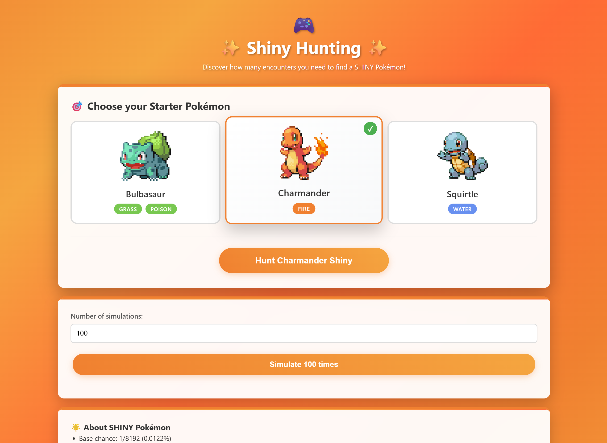

# 🌟 Shiny Hunting - Pokémon SHINY Encounter Simulator

An interactive simulator to discover how many encounters are needed to find SHINY Pokémon in Fire Red!

## 🎮 Features

- **Statistical Simulation**: Run multiple simulations to find SHINY Pokémon
- **Complete Analysis**: View detailed statistics like average, median, minimum and maximum
- **Real Time Calculation**: Discover how much time it would take in real gameplay (30 seconds per encounter)
- **Modern Interface**: Responsive design with animations and attractive visualizations
- **Authentic Audio**: Real Pokémon cries and SHINY celebration sounds
- **Advanced Visualizations**: Charts, heatmaps, and comprehensive statistics

## 🚀 How to Use

1. **Install dependencies**:
   ```bash
   npm install
   ```

2. **Start development server**:
   ```bash
   npm start
   ```

3. **Open your browser** and access `http://localhost:3000`

4. **Choose your starter Pokémon** (Bulbasaur, Charmander, or Squirtle)

5. **Enter the number of simulations** you want to run (ex: 100, 1000, 10000)

6. **Click "Simulate"** and wait for the results!

## 📊 What the simulator shows

- **Average Attempts**: Average number of encounters to find SHINY
- **Median**: Central value of attempts
- **Minimum/Maximum**: Lowest and highest number of attempts recorded
- **Estimated Real Time**: Converted to readable format (days, hours, minutes)
- **Comparative Analysis**: Comparison with theoretical chance (1/8192)
- **Visual Charts**: Distribution charts and heatmaps
- **Time Calculations**: Real gameplay time estimates

## 🎯 About SHINY Hunting

- **Base chance**: 1/8192 (0.0122%)
- **Time per encounter**: ~30 seconds
- **Estimated average time**: ~68 hours of gameplay
- **Generation**: Fire Red/Leaf Green (Gen 3)
- **Available Pokémon**: Bulbasaur, Charmander, Squirtle

## 🛠️ Technologies

- **React 18** with TypeScript
- **CSS3** with modern animations
- **Web Audio API** for authentic sounds
- **Chart.js** for data visualizations
- **Responsive Design** for all devices
- **Real-time statistics** during simulation

## 📱 Technical Features

- Asynchronous simulation to avoid UI blocking
- Real-time progress bar
- Accurate statistical calculations
- Smart time formatting
- Performance-optimized interface
- Audio management with MP3 files
- Advanced data visualization components

## 🎨 Design

- Vibrant gradients inspired by Pokémon
- Smooth animations and micro-interactions
- Informative cards with statistics
- Responsive and modern layout
- Attractive emojis and visual elements
- Dynamic theming based on selected Pokémon
- SHINY celebration animations

## 🎵 Audio Features

- **Authentic Pokémon Cries**: MP3 files for Bulbasaur, Charmander, and Squirtle
- **SHINY Celebration Sound**: Special audio when finding SHINY
- **Smart Audio Management**: Prioritizes real audio files
- **Fallback System**: Graceful error handling

## 🌟 Experience

- **Pokémon Selection**: Hear authentic cries when choosing your Pokémon
- **Hunting Simulation**: Watch real-time progress with animations
- **SHINY Discovery**: Celebrate with special animations and sounds
- **Statistics Dashboard**: Comprehensive analysis of your hunting results

## 📸 Screenshot



*Interactive SHINY Pokémon hunting simulator with authentic cries and beautiful animations*

Enjoy the simulator and good luck on your SHINY hunting journey! 🌟✨

---

## 🚀 Quick Start

```bash
# Clone the repository
git clone https://github.com/EduBrQ/shiny-hunt.git

# Navigate to project
cd shiny-hunt

# Install dependencies
npm install

# Start the application
npm start
```

Visit `http://localhost:3000` to start your SHINY hunting adventure!

